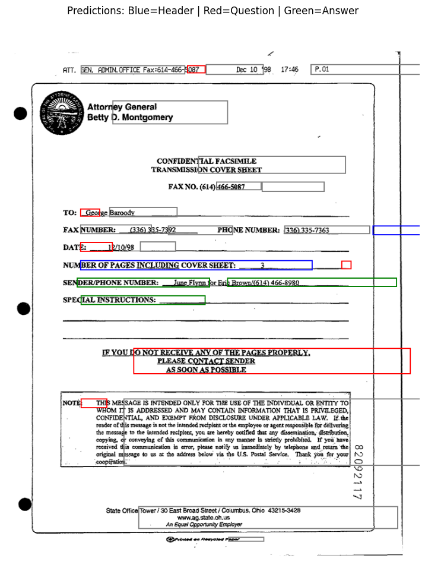

# Layout-Aware Form Understanding with LayoutLMv3

Fine-tuning **Microsoft LayoutLMv3** on the **FUNSD** dataset for named entity recognition across scanned form documents — classifying each word token as a **Header**, **Question**, or **Answer** using joint text, layout, and image encoding.

---

## Results

| Entity | Precision | Recall | F1 |
|--------|-----------|--------|----|
| ANSWER | 0.90 | 0.91 | **0.91** |
| QUESTION | 0.88 | 0.91 | **0.89** |
| HEADER | 0.57 | 0.61 | **0.59** |
| **Overall** | **0.87** | **0.89** | **0.8791** |

Trained for 10 epochs on Google Colab (T4 GPU). Best checkpoint selected by F1 score.

---

## Prediction Visualization



🔵 Blue = Header | 🔴 Red = Question | 🟢 Green = Answer

---

## What This Project Does

Standard NLP models treat documents as flat text sequences. LayoutLMv3 encodes three signals jointly:

- **Text** — the words on the document
- **Layout** — normalized bounding box coordinates (x0, y0, x1, y1) for each token
- **Image** — visual patches from the scanned document image

This allows the model to understand that a word's position on a form is as informative as the word itself — a core requirement for real-world document parsing.

---

## Dataset

**FUNSD** (Form Understanding in Noisy Scanned Documents)
- 199 real scanned forms: 149 train / 50 test
- Each sample: tokens, bboxes (normalized 0-1000), ner_tags, image
- Source: https://huggingface.co/datasets/nielsr/funsd-layoutlmv3

---

## Model

**LayoutLMv3-base** (Microsoft, 125M parameters)
- Paper: https://arxiv.org/abs/2204.08387
- Token classification head added on top with 7 output classes (BIO tagging)

**Training config:**

| Parameter | Value |
|-----------|-------|
| Epochs | 10 |
| Learning rate | 1e-5 |
| Batch size | 2 |
| Max sequence length | 512 |
| Best model selection | F1 score |

---

## How to Run

### Option 1 - Google Colab (recommended)
Open notebook.ipynb directly in Colab. Switch runtime to T4 GPU before running.

### Option 2 - Local
```bash
git clone https://github.com/SHABCODES/layoutlmv3-funsd-form-understanding
cd layoutlmv3-funsd-form-understanding
pip install -r requirements.txt
jupyter notebook notebook.ipynb
```

### Option 3 - Docker
```bash
docker build -t layoutlmv3-funsd .
docker run -p 8888:8888 layoutlmv3-funsd
# Open http://localhost:8888 in your browser
```

---

## Project Structure

```
layoutlmv3-funsd-form-understanding/
├── notebook.ipynb               # Full training + evaluation notebook
├── predictions_visualized.png   # Model output on test document
├── requirements.txt             # Python dependencies
├── Dockerfile                   # Container for reproducible runs
└── README.md
```

---

## Tech Stack

PyTorch · HuggingFace Transformers · LayoutLMv3 · seqeval · Docker · Google Colab
