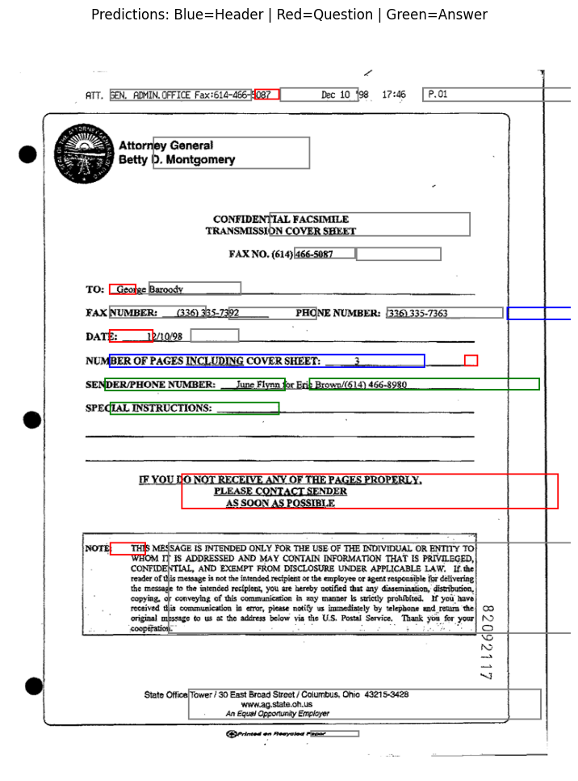

# Layout-Aware Form Understanding with LayoutLMv3

Fine-tuning **Microsoft LayoutLMv3** on the **FUNSD** dataset to classify every word in a scanned
form as a **Header**, **Question**, or **Answer**, using joint text + layout + image encoding —
then shipping it as a real service: a FastAPI backend that runs OCR on arbitrary document images
and a small web client that visualizes the predictions.

```
notebook.ipynb  →  model/ (exported checkpoint)  →  app/api.py (FastAPI)  →  web/ (demo client)
   training              artifact                      inference                consumption
```

---

## What changed in this version

Starting from a baseline training notebook, this pass focused on the kind of issues that only show
up once you try to actually use a model rather than just report its metrics:

- **Fixed a silent misalignment bug** in prediction visualization. The original code zipped raw
  word-level tokens/boxes against subword-level model predictions positionally — correct only when
  every word happens to tokenize into exactly one subword. Now uses `word_ids()` to map each word to
  its first subword's prediction, which is what LayoutLMv3 actually expects.
- **Diagnosed and addressed the weak HEADER class** (0.59 F1 vs ~0.90 for ANSWER/QUESTION in the
  baseline) instead of just reporting it: HEADER has ~9x fewer training tokens than QUESTION. Added
  inverse-frequency class weighting via a custom `Trainer` subclass.
- **Added OCR-based inference** so the model works on documents that don't come with pre-annotated
  words/boxes (i.e. anything that isn't the FUNSD test set) — the actual condition any real input
  arrives in.
- **Productionized the model** behind a FastAPI service (`app/api.py`) with a reusable inference
  module (`app/inference.py`), plus a zero-build-step web client (`web/`) to demo it end to end.

---

## Results

Baseline (unweighted loss), 10 epochs on Google Colab (T4 GPU), best checkpoint by F1:

| Entity | Precision | Recall | F1 |
|--------|-----------|--------|----|
| ANSWER | 0.90 | 0.91 | **0.91** |
| QUESTION | 0.88 | 0.91 | **0.89** |
| HEADER | 0.57 | 0.61 | **0.59** |
| **Overall** | **0.87** | **0.89** | **0.8791** |

The class-weighting fix (notebook Section 8) targets the HEADER row specifically — re-run Section 11
after training to get updated numbers; the notebook documents the expected trade-off (HEADER
precision/recall should rise, at a small likely cost to overall accuracy) rather than assuming it.



🔵 Blue = Header | 🔴 Red = Question | 🟢 Green = Answer

---

## What This Project Does

Standard NLP models treat documents as flat text sequences. LayoutLMv3 encodes three signals jointly:

- **Text** — the words on the document
- **Layout** — normalized bounding box coordinates (x0, y0, x1, y1) for each token
- **Image** — visual patches from the scanned document image

This allows the model to understand that a word's position on a form is as informative as the word
itself — a core requirement for real-world document parsing.

---

## Dataset

**FUNSD** (Form Understanding in Noisy Scanned Documents)
- 199 real scanned forms: 149 train / 50 test
- Each sample: tokens, bboxes (normalized 0-1000), ner_tags, image
- Source: https://huggingface.co/datasets/nielsr/funsd-layoutlmv3

---

## Model

**LayoutLMv3-base** (Microsoft, 125M parameters)
- Paper: https://arxiv.org/abs/2204.08387
- Token classification head added on top with 7 output classes (BIO tagging)
- Weighted cross-entropy loss to correct for class imbalance (see notebook Section 8)

**Training config:**

| Parameter | Value |
|-----------|-------|
| Epochs | 10 |
| Learning rate | 1e-5 |
| Batch size | 2 |
| Max sequence length | 512 |
| Best model selection | F1 score |

---

## How to Run

### 1. Train the model

**Option A — Google Colab (recommended):** open `notebook.ipynb` directly in Colab, switch runtime
to a T4 GPU, and run all cells. Section 12 exports the trained model to `./model`.

**Option B — Local:**
```bash
git clone https://github.com/SHABCODES/layoutlmv3-funsd-form-understanding
cd layoutlmv3-funsd-form-understanding
pip install -r requirements.txt
jupyter notebook notebook.ipynb
```

**Option C — Docker (notebook only):**
```bash
docker build -f Dockerfile.notebook -t layoutlmv3-funsd-notebook .
docker run -p 8888:8888 layoutlmv3-funsd-notebook
# Open http://localhost:8888
```

### 2. Serve predictions

Once `model/` exists (from step 1), start the API:
```bash
pip install -r requirements.txt   # includes fastapi + uvicorn
uvicorn app.api:app --reload --port 8000
```

Or via Docker:
```bash
docker build -f Dockerfile.serve -t layoutlmv3-funsd-api .
docker run -p 8000:8000 -v $(pwd)/model:/app/model layoutlmv3-funsd-api
```

Test it directly:
```bash
curl -F "file=@your_form.png" http://localhost:8000/predict
```

### 3. Try the demo client

Open `web/index.html` in a browser (no build step, no npm install). Upload an image, hit
"Run prediction" — it calls the API above and draws color-coded boxes over the words.

---

## Project Structure

```
layoutlmv3-funsd-form-understanding/
├── notebook.ipynb               # Data exploration, weighted training, evaluation, OCR inference
├── app/
│   ├── inference.py              # Model loading + OCR-based prediction (shared, production code)
│   └── api.py                    # FastAPI service exposing POST /predict
├── web/
│   ├── index.html                # Zero-build demo client
│   ├── app.js
│   └── style.css
├── predictions_visualized.png   # Model output on a test document
├── requirements.txt              # Training + serving dependencies
├── Dockerfile.notebook           # Container for training/experimentation
├── Dockerfile.serve              # Container for the FastAPI service
└── README.md
```

---

## Known Limitations / Next Steps

- OCR quality (Tesseract) is the ceiling on real-world accuracy — a noisy scan produces noisy words
  and boxes regardless of how good the classifier is. Swapping in a stronger OCR engine (e.g. a
  cloud OCR API) would likely move the needle more than further model tuning at this point.
- The API currently loads one model checkpoint at startup; there's no batching or GPU-queue
  management, which would matter for anything beyond demo-scale traffic.
- No auth/rate-limiting on `/predict` — fine for a local demo, not for a public deployment.

---

## Tech Stack

PyTorch · HuggingFace Transformers · LayoutLMv3 · seqeval · FastAPI · Tesseract OCR · Docker · Google Colab
